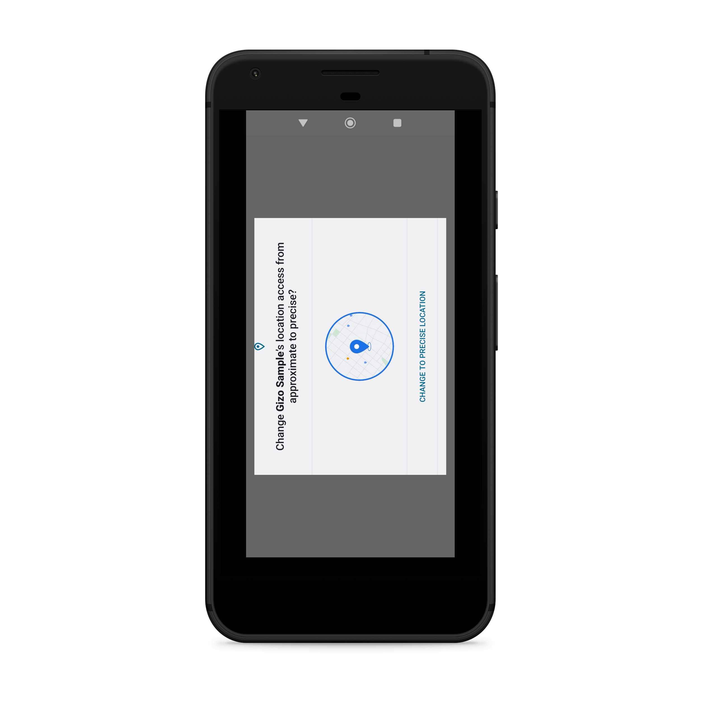
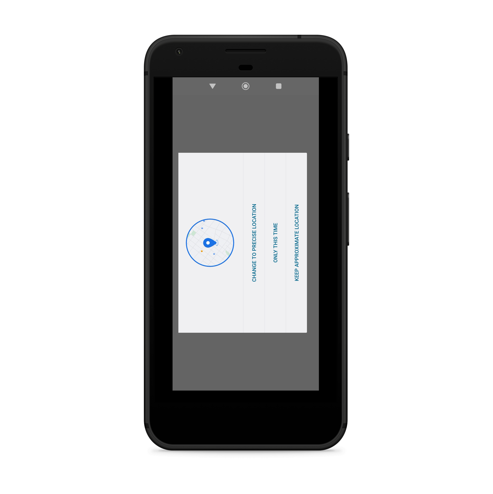
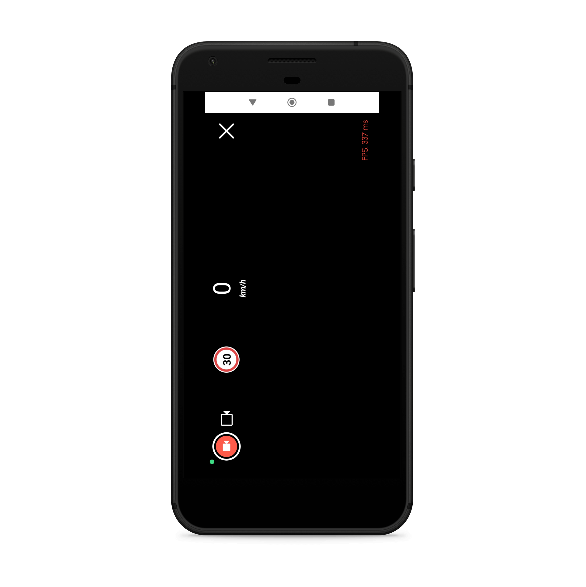

# 📋 Overview

My Test library is a controlling driving library for Android.

Gizo SDK library is an Android library that does amazing things. It is designed to help users to be more careful on how to drive their cars and if any risk is felt while driving, it informs users of a possible error by giving warnings.

<figure><figcaption></figcaption></figure>

 

<figure><figcaption></figcaption></figure>

 

<figure><figcaption></figcaption></figure>

## Features

* feature number one
* feature number two
* feature number three
* feature number four
* feature number five
* feature number six
